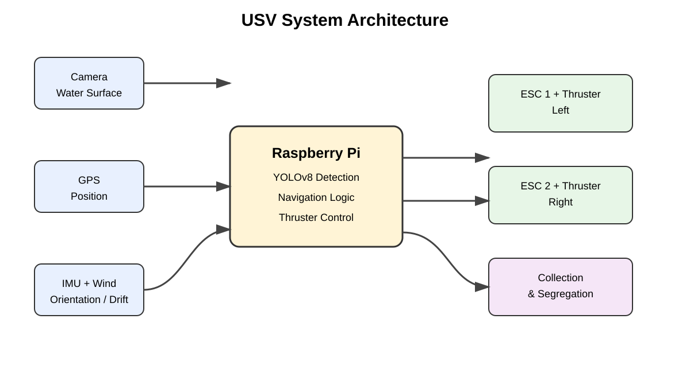
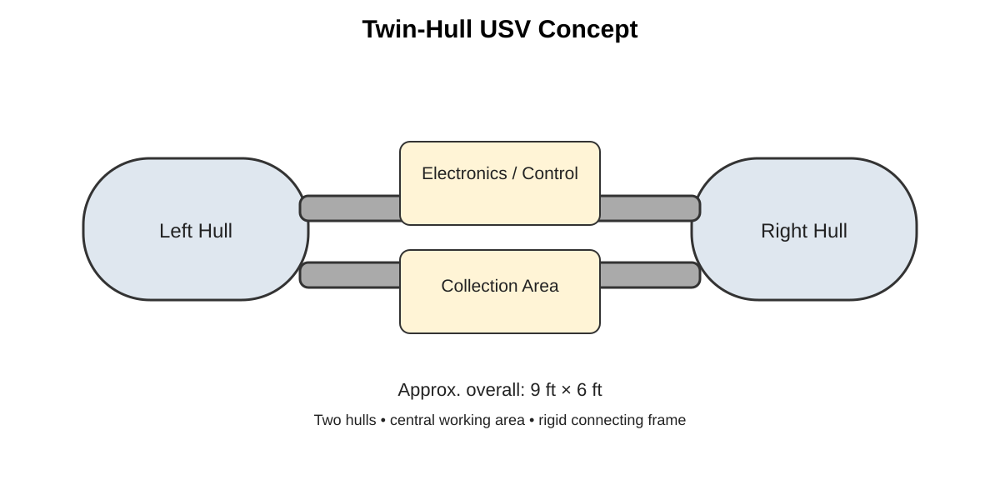

# 🌊 AI-Enabled Unmanned Surface Vehicle for Water Waste Collection

A student-built autonomous surface vehicle designed to detect floating waste on lakes and ponds and assist with collection and segregation.

This project brings together **robotics, embedded systems, computer vision, artificial intelligence, and autonomous navigation** in one practical environmental application.

> **Project status:** Prototype / Under Development 🚧
>
> This repository is maintained as a team member's project repository. Hardware and software details will be updated as the prototype is tested and improved.



---

## 📖 About the Project

Floating plastic bottles, wrappers, packets and other solid waste are a common problem in surface water bodies. Manual cleaning is repetitive and can become difficult when the water body is large or polluted.

Our approach is to build a small **Unmanned Surface Vehicle (USV)** that can move over the water, identify floating waste using a camera and an AI model, move towards the selected target and assist in collecting the waste.

The project is being developed as a practical student prototype. Instead of assuming that every feature will work perfectly from the beginning, the system is divided into smaller modules and tested step by step.

---

## 🎯 Objectives

- Build a stable floating twin-hull platform.
- Detect floating waste using a camera and YOLOv8.
- Process the AI model locally using Raspberry Pi.
- Use GPS and orientation sensors for navigation.
- Control the propulsion system using ESCs and brushless thrusters.
- Use wind information to reduce unwanted drift.
- Collect floating waste at the water surface.
- Explore automatic waste segregation.
- Create a low-cost platform that can be improved in future versions.

---

## ⚙️ Basic Working Principle

```text
Camera
  ↓
Capture Water-Surface Image
  ↓
YOLOv8 Waste Detection
  ↓
Select Target
  ↓
Navigation Controller
  ↑       ↑       ↑
 GPS    IMU    Wind Sensor
  ↓
Thruster Control
  ↓
Move Towards Waste
  ↓
Collection / Segregation
```

The camera provides visual information. The AI model identifies waste in the image. Navigation sensors provide information about the vehicle's position and orientation. The Raspberry Pi combines these inputs and generates control commands for the propulsion system.

---

## 🧩 System Architecture


The system is divided into six major parts:

1. **Sensing** – camera, GPS, IMU/compass and wind sensor.
2. **AI perception** – YOLOv8-based waste detection.
3. **Decision making** – target selection and navigation logic.
4. **Motion control** – ESC and thruster control.
5. **Waste handling** – collection and segregation mechanism.
6. **Power** – battery and regulated power distribution.

---

## 🚤 Mechanical Design

The current concept uses **two hulls connected by a rigid frame**. The twin-hull arrangement gives a wider base and leaves a central working area for the electronics and waste-handling mechanism.

### Current design dimensions

| Parameter | Approximate value |
|---|---:|
| Overall length | 9 ft |
| Overall breadth | 6 ft |
| Individual hull width | 2 ft |
| Gap between hulls | 2 ft |
| Hull arrangement | Twin hull |

These dimensions are prototype values and can change after water testing. Payload, battery weight, motor position and water conditions all affect stability.



### Design priorities

- Good stability on calm water.
- Sufficient freeboard.
- Protected electronics.
- Clear camera view.
- Easy maintenance.
- Safe thruster placement.
- Enough room for the collection system.

---

## 🔩 Hardware

| Component | Purpose |
|---|---|
| Raspberry Pi 4 (8 GB) | Main computer and control unit |
| Camera | Water-surface image capture |
| GPS | Position information |
| IMU / Compass | Heading and motion information |
| Wind sensor | Wind direction measurement |
| Brushless underwater thrusters | Propulsion |
| Flycolor Raptor 30A ESCs | Thruster speed control |
| 3S 11.1 V LiPo battery | Main power source |
| Twin hulls / pontoons | Buoyancy and stability |
| Collection mechanism | Floating waste handling |

### Example propulsion setup

The prototype has considered **ApisQueen U2 Mini underwater thrusters** with suitable ESCs. A higher-power U2-class 12–16 V brushless thruster is also being evaluated for later versions.

The final motor selection should always be matched with the ESC, battery voltage, waterproof connectors and expected load.

---

## 🔋 Power System

A LiPo battery supplies the propulsion and electronics through suitable power distribution and regulation.

```text
                 3S LiPo Battery
                        │
                 Power Distribution
                   ┌────┴────┐
                   │         │
                 ESCs    DC Regulation
                   │         │
              Thrusters   Raspberry Pi
                              │
                    Sensors + Camera
```

The Raspberry Pi should not be connected directly to the high-current motor supply. Proper regulation and common grounding are required between the control electronics and ESC signal system.

---

## 🤖 AI Waste Detection

The computer vision part of the project uses a **YOLOv8-based model** to detect floating waste from camera frames.

The intended pipeline is:

```text
Camera Frame
     ↓
Pre-processing
     ↓
YOLOv8 Inference
     ↓
Bounding Box + Class + Confidence
     ↓
Target Selection
     ↓
Navigation Controller
```

A project-specific dataset can be created using photographs of waste floating in ponds and lakes. Images should be labelled according to the waste classes required by the project.

The model is intended to run locally on the Raspberry Pi so that the vehicle does not depend completely on an internet connection.

### Possible classes

The exact classes will depend on the final dataset. Examples include:

- Plastic bottle
- Plastic bag
- Food wrapper
- Floating container
- Other solid waste

Model performance will be reported only after proper testing. No artificial accuracy numbers are included in this repository.

---

## 🧭 Autonomous Navigation

Navigation is implemented as a separate module so that it can first be tested without AI.

### Navigation inputs

- GPS position
- IMU/compass heading
- Target location or target direction
- Wind direction

### Navigation process

1. Read the current position.
2. Read the current heading.
3. Determine the target direction.
4. Calculate heading error.
5. Adjust left and right thruster commands.
6. Repeat the process continuously.

For a differential-thrust vehicle, changing the relative speed of the two thrusters produces steering.

---

## 🌬️ Wind Compensation

A lightweight USV can drift because of wind. The project therefore considers a wind sensor as an additional input to the controller.

```text
Wind Sensor
     ↓
Wind Direction
     ↓
Compensation Logic
     ↓
Desired Thruster Correction
     ↓
Left / Right ESCs
```

The first tests should be performed in calm water. Wind compensation can then be introduced gradually and evaluated using measured position error.

---

## ⚙️ Thruster Control

The Raspberry Pi sends control signals to the ESCs. The ESCs handle the electrical switching required by the brushless thrusters.

```text
Raspberry Pi
    │
    ├── Signal ──► ESC 1 ──► Left Thruster
    │
    └── Signal ──► ESC 2 ──► Right Thruster
```

Typical differential-thrust behaviour:

| Left thruster | Right thruster | Result |
|---|---|---|
| Same forward command | Same forward command | Forward movement |
| Reduced | Higher | Turn left |
| Higher | Reduced | Turn right |
| Minimum | Minimum | Stop / idle |

Exact PWM/command ranges must be calibrated with the actual ESC and motor combination.

---

## 🗑️ Waste Collection and Segregation

The vehicle is intended to collect waste from the water surface without requiring a person to enter the water.

One design direction being explored is a **non-contact water-jet based guiding mechanism**, where a small pump, valve and nozzle can guide floating waste towards the collection area. The nozzle can be angled sideways so that it does not interfere with the propulsion system.

The collection concept can be represented as:

```text
Detected Waste
      ↓
Approach Waste
      ↓
Guide / Collect
      ↓
Transfer to Storage Area
      ↓
Segregate by Type
```

The mechanical system is still under development, so this section will be updated after physical testing.

---

## 💻 Software Structure

The intended software organisation is modular:

```text
src/
├── ai_detection/
│   └── waste_detection.py
├── navigation/
│   └── navigation_controller.py
├── sensors/
│   ├── gps.py
│   ├── imu.py
│   └── wind_sensor.py
└── thruster_control/
    └── motor_controller.py
```

Separating the modules makes troubleshooting easier. For example, GPS can be tested independently before connecting it to autonomous navigation.

---

## 🧪 Development and Testing

The project is being approached in stages.

### Phase 1 – Floating platform

- Assemble both hulls.
- Check buoyancy.
- Check stability with the expected payload.

### Phase 2 – Propulsion

- Install thrusters.
- Calibrate ESCs.
- Test forward movement.
- Test turning response.

### Phase 3 – Sensors

- Test GPS.
- Test IMU/compass.
- Test wind sensor.

### Phase 4 – AI

- Collect images.
- Label waste.
- Train YOLOv8.
- Validate the model.
- Test inference on Raspberry Pi.

### Phase 5 – Navigation

- Implement heading control.
- Test waypoint movement.
- Measure position error.

### Phase 6 – Full integration

- Combine AI and navigation.
- Add waste collection.
- Test the complete system in controlled water.

---

## 📊 Evaluation Metrics

The final prototype should be evaluated using measurable results.

### AI

- Precision
- Recall
- mAP
- Inference FPS
- Detection confidence

### Navigation

- Position error
- Heading error
- Waypoint accuracy
- Turning response
- Wind-induced drift

### Collection

- Successful collection percentage
- Collection time per object
- Waste handling capacity
- Segregation accuracy

### Power

- Battery runtime
- Average current
- Peak current
- Power consumption during AI inference

> Results will be added after actual experiments. The repository deliberately avoids claiming test values that have not been measured.

---

## 📷 Project Images

Real photographs from the team should be added here as the prototype develops.

Recommended files:

```text
images/
├── system-architecture.svg
├── mechanical-concept.svg
├── hardware-setup.jpg
├── usv-prototype.jpg
├── ai-detection.jpg
└── water-test.jpg
```

For example:

```markdown

```

Using actual project photographs is preferred because the repository should document the real development process rather than use unrelated stock images.

---

## 📁 Repository Structure

```text
Unmanned-Surface-Vehicle-/
│
├── README.md
├── docs/
│   ├── system-architecture.md
│   ├── hardware.md
│   ├── software.md
│   ├── navigation.md
│   ├── ai-waste-detection.md
│   └── testing.md
│
├── images/
│   ├── system-architecture.svg
│   └── mechanical-concept.svg
│
├── src/
│   ├── ai_detection/
│   ├── navigation/
│   ├── sensors/
│   └── thruster_control/
│
├── models/
├── hardware/
├── requirements.txt
├── .gitignore
└── LICENSE
```

---

## 🚀 Future Improvements

- Improve the project-specific waste dataset.
- Optimise the AI model for Raspberry Pi.
- Add obstacle detection and avoidance.
- Improve GPS/heading accuracy.
- Add telemetry from the USV to a ground station.
- Add return-to-home functionality.
- Add water-quality sensors.
- Improve automatic waste segregation.
- Explore solar-assisted charging.
- Improve stability for moderate wind conditions.

---

## 👥 Team Contribution

This is a collaborative student project. Individual team members can be listed here with their actual responsibilities.

### Shajan Raj

**Area:** Software / AI / ML / Raspberry Pi

**Role:** Technical development and integration

Responsibilities include working on the AI-based waste detection pipeline, Raspberry Pi integration, software development, system integration and testing.

Other team members and their contributions should be added as the project documentation is finalised.

---

## 📌 Current Status

**Prototype under development 🚧**

The mechanical structure, electronics, AI pipeline, navigation and collection mechanism are being developed and tested separately before final integration.

---

## 🙏 Acknowledgement

This project is being developed as a student engineering project with the aim of applying AI and robotics to a real environmental problem.

The repository will continue to change as we build, test, find problems, and improve the design.

**Built, tested, modified, and tested again. 🌊🤖**
